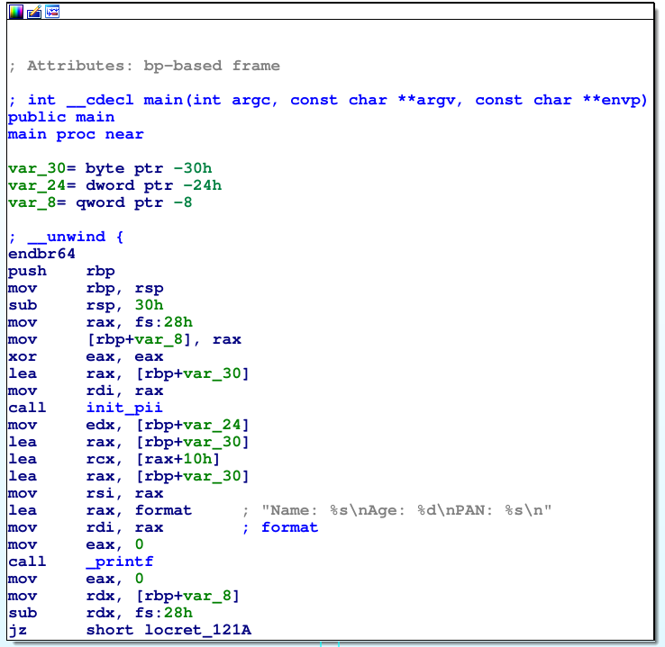
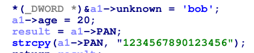

+++
title = 'Tackling Disassembled Structs in IDA - Malware Analysis'
date = 2024-01-18T23:29:54Z
draft = false
tags = ["Malware Analysis", "Reverse Engineering"]
+++

Reverse engineering software is a lot of work. Personally, the hardest part is figuring out which areas are worth examining further. Looking in the wrong places can cause you to miss valuable information. 

One construct that can trip people up is struct representation in assembly. It can be unclear when a struct is being manipulated or accessed. After all, the struct is organised as a contiguous block of bytes, with each member residing sequentially in memory. Remembering this can actually be helpful to us.


*A look at how an example struct resides in memory*

When we find code that seems to access random offsets in memory, that's a good sign that a struct is being used. It is then up to us to figure out the dimensions of each field, and what they are being used for. Thankfully, it's easy to gain some practice doing this - by writing and disassembling our own code! We'll use the struct shown in the figure above in the program that we're going to reverse ourselves.

## Starting From Scratch

Let's start by writing a small C program that uses structs to store information. Afterwards, compile it and open the binary up in IDA to see what it looks like.

```c
#include <string.h>
#include <stdio.h>

typedef struct pii {
    char name[10];
    int age;
    char PAN[17]; // We use a size of 17 to include the null terminator
} pii;

void init_pii(pii* p_pii)
{
    strcpy(p_pii->name, "bob");
    p_pii->age = 20;
    strcpy(p_pii->PAN, "1234567890123456");
}

int main()
{
    pii bob_pii;
    init_pii(&bob_pii);

    printf("Name: %s\nAge: %d\nPAN: %s\n", bob_pii.name, bob_pii.age, bob_pii.PAN);
    return 0;
}
```

Here's a breakdown of what the program does if you're not familiar with C:
- The entrypoint is main. We initialise an empty `pii` struct, a type that we declared at the top of the file, containing fields of static length (10, 4, 17)
- We then pass that empty struct address to the `init_pii` function, which assigns values to each field
- Finally, we print the values that were assigned by `init_pii`

Remember that your binary won't contain the typedefs you declare, which is why we're tackling this issue in the first place.

I'll compile this program (using `gcc` on Linux) and open it up in IDA.

## Surgical



This looks like a lot. But remember to focus on the important parts.  
We'll pretend that we are unaware of any struct declarations in this program. We'll go through the process of deducing these ourselves.

One thing shown here that can be confusing is the declaration of multiple variables for what we know is one struct. It wouldn't be fatal to assume these were separate variables initially.  
Another thing you may have noticed is the compile-time assertions that do stack safety checks. We can ignore those (they're just extra noise). Let's dive into the `init_pii` function early - we know that it's responsible for something important, because the program starts accessing values right after it has been called (this is the type of thought process we need to develop).

It's important to mention that we usually won't have function names. For a more realistic scenario, strip the symbol table with `gcc`'s `-s` option.

  
*Disassembly of init_pii*

Looks pretty complicated. Our `strcpy` calls were inlined too, which doesn't help at all! This is where the IDA decompiler / pseudocode view can help. It can actually recognise operations like `strcpy` and represent them in the pseudocode view.

  
*Pseudocode representation of init_pii*

Isn't that helpful? Granted, it didn't expand *everything*. But hopefully, we can work with what we have now.

## Creating our structure

`init_pii` almost looks like a serialisation routine, as it seems to be manipulating variable offsets. This is another telling sign of struct manipulation. We can see that (a1 + 12) to (a1 + 16) is where '20' is assigned (`age`, if you remember). We also see that the PAN is copied to a1 + 16 and onwards. We can use these details to start defining our custom struct in IDA.

Open the structure subview and press the `Insert` key (or, right-click and press 'Add struct type').

  
*Give your struct a name, I've named it personal_info*

While the struct is highlighted, press the `A` key to add a new string field for our 'unknown' offset of a1 to (a1 + 11) (inclusive). We give it an array size of 12. Next, while `ends` is highlighted, add the `DWORD` 'age' field by pressing the `D` key and cycling through the data types (by repeatedly pressing `D` while the new field is highlighted) until we get to `dd`, aka 'define double word' (`DWORD`). Finally, highlighting `ends` again, add another string of size 17 to represent the PAN that was assigned by pressing `A`. Name your struct fields by pressing `N` while they are highlighted.

Your struct should end up looking something like this:


Now we can convert a1 by right-clicking -> 'convert to struct\*', and selecting the struct you defined.


Much better. Now although we still see unknown as a number, we can try to convert it to character representation by highlighting the number and pressing `R`. We know to do this because before the call to `printf`, a1 / `var_30` is passed to `rsi`, which is printed in string format. Although it usually isn't this easy to figure out, getting clues from the context and usage of offsets is equally as important.



Now, select `var_30` (or whatever variable is used as the struct) and hit `Ctrl+K` to open it in the stack frame view. Right-click and select 'struct var', then choose the struct you defined. Now go back to the main function view, and hit F5 (or `Fn+F5`) to view `main` as pseudocode.


Now that's (almost) completely readable!

## Conclusion

I hope this post taught you a thing or two about deobfuscating disassembled code to make the reverse engineering process easier. These techniques are easily applied to malware analysis, vulnerability research, or any sort of tampering.
