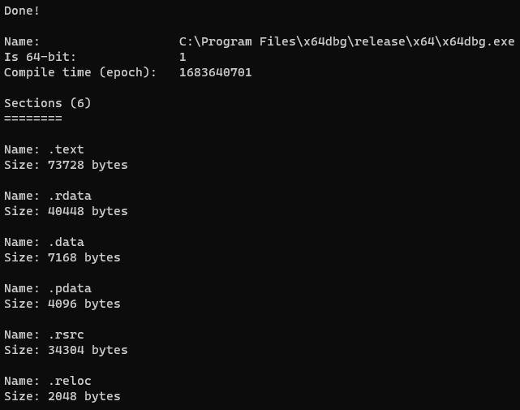

+++
title = 'Understanding the Windows Portable Executable, Part 1 - PE Format'
date = 2024-02-27T18:47:18Z
draft = false
+++

## Introduction

This series aims to demonstrate how create tools based on your own research. To fully grasp how to work with Windows PEs, for use in malware development and analysis, we're only using documentation from Microsoft. This approach helps me personally when it comes to developing new research, acquiring a well-rounded understanding of a topic, and improves my creativity. Hopefully it helps you too.

By the end of this article, we will have written a tool in C that extracts basic information from a given Windows PE.

All sources are under the 'references' heading at the end of this article.

## The Windows Portable Executable

In short, the Windows PE is a file format for executables, as well as a couple other file types. This file has a specific structure that tells Windows how to load it, where to load it, and how to execute it. You can also gather some information about the file by parsing it manually, which is what we'll do in this article.

By the end of this, we should be able to extract:
- The file signature (to validate whether it is a PE or not)
- Whether the PE is 64-bit or not
- The compile time
- Information about each section:
	- Name
	- Size

This article assumes that you are familiar with C/C++.

## Reading the PE into memory

We want to start by retrieving the PE headers. I mentioned that this is being done in a malware development context. So, we'll be doing this in a dedicated function, from a buffer containing a PE. in a real life scenario, we wouldn't want our payload touching disk at all, would we? ;)

There are some structures defined in `winnt.h` that we use for this purpose. All portable executables start with a DOS header. So we'll make our program load a provided file into memory, and extract the DOS header from the buffer it resides in.

We start by reading our file into memory.

```c
int main(int argc, char** argv)
{
	HANDLE hFile;
	HANDLE hProcHeap;
	CHAR* pFileBuf;
	BOOL status;
	DWORD dwFileSize, dwBytesRead;
	DWORD ldrStatus;
	PPE_CONTEXT pContext = NULL;

	if (argc < 2)
	{
		printf(
			"A tool for loading portable executables into memory and extracting information from them.\n\n"
			"Usage: %s PE\n\n"
			"Args:\n"
			"    PE: The path to the PE to load\n",
			argv[0]
		);
		return 1;
	}
	hFile = CreateFileA(argv[1], GENERIC_READ | GENERIC_WRITE, 0, NULL, OPEN_EXISTING, FILE_ATTRIBUTE_NORMAL, (HANDLE)NULL);
	if (hFile == INVALID_HANDLE_VALUE)
	{
		printf("CreateFile failed (%d)\n", GetLastError());
		return 1;
	}
	dwFileSize = GetFileSize(hFile, (LPDWORD)NULL);
	hProcHeap = GetProcessHeap();
	pFileBuf = (CHAR*)HeapAlloc(hProcHeap, HEAP_ZERO_MEMORY, dwFileSize);
	if (!pFileBuf)
	{
		printf("HeapAlloc failed (%d)\n", GetLastError());
		return 1;
	}
	status = ReadFile(hFile, (LPVOID)pFileBuf, dwFileSize, &dwBytesRead, (LPOVERLAPPED)NULL);
	if (!status)
	{
		printf("ReadFile failed (%d)\n", GetLastError());
		HeapFree(hProcHeap, 0, (LPVOID)pFileBuf);
		return 1;
	}
}
``` 

Simple enough, right?
The steps are:
- Get handle to our file (`CreateFile`)
- Calculate size of file (`GetFileSize`)
- Allocate memory for our file (`GetProcessHeap`, `HeapAlloc`)
- Read our file into the buffer (`ReadFile`)

Things you may not be used to:
- HANDLE: A representation of an object, used by WinAPI. It's just a void pointer.
- Why use `GetProcessHeap` and `HeapAlloc` instead of `malloc`? Windows 'heap' functions are module independent. By allowing you to specify which heap to allocate memory on, you can pass across
pointers to dynamically allocated blocks of memory without having to worry about memory corruption. I actually don't need to use it at all here, but for this reason, it can be seen as good practice for more complex projects. TL;DR: idk

## Parsing PE Headers

For this, I'd personally like to define some neat structs for quick access to different parts of the PE. This struct will hold the fields that I'm extracting for this exercise, as well as useful file offsets (in case we wanted to access parts of the PE later without having to re-parse it).

We define structures for useful information in our PE parser header file, `peparse.h`:

```c
#include <Windows.h>

typedef struct _PE_SECTION_CONTEXT {
	LPCSTR szName;
	DWORD dwSize;
	struct _PE_SECTION_CONTEXT *Next;
} PE_SECTION_CONTEXT, * PPE_SECTION_CONTEXT;

typedef struct _PE_CONTEXT {
	BOOL isX64;
	HANDLE hHeap;
	LPVOID pImageBase;
	PIMAGE_DOS_HEADER pDosHeader;
	PIMAGE_FILE_HEADER pFileHeader;
	DWORD CompileTime;
	WORD SectionCount;
	PPE_SECTION_CONTEXT SectionCtxList;
} PE_CONTEXT, *PPE_CONTEXT;
```

We store information about each section in a linked list `SectionCtxList`. We also have a field for a handle to the heap used to allocate memory for the `PE_CONTEXT` structure, which we'll make use of when it's time to free this memory.

Next, we define the two functions we will need to parse the headers.

```c
// ParsePEFromBuffer parses a PE file's information into a PE_CONTEXT structure.
// If unsuccessful, if returns a non-zero value. Use PEGetLastError() to get error information.
DWORD PEParseFromBuffer(LPVOID lpBuffer, PPE_CONTEXT pCtx);
DWORD PEFreeCtx(PPE_CONTEXT pCtx);
```

Finally, I'll define some generic status codes that these functions will return.

```c
#define PE_SUCCESS 0
#define PE_INVALID_PE 1
#define PE_CTX_ALLOC_FAILED 2
#define PE_CTX_FREE_FAILED 3
#define PE_SECTION_CTX_ALLOC_FAILED 4
#define PE_SECTION_CTX_FREE_FAILED 5
```

## PEParseFromBuffer

I will do my best to explain the key steps taken while defining this function.
Firstly, we want it to be called by passing a pointer to a (null) PE_CONTEXT struct pointer, making us responsible for allocation as well as its release. This is why we keep a reference to the heap that the structure was allocated on within the structure itself.

```c
#include <stdio.h>

#include "peparse.h"

DWORD PEParseFromBuffer(LPVOID lpBuffer, PPE_CONTEXT* Ctx)
{
	HANDLE hHeap;
	PIMAGE_NT_HEADERS pNtHeaders;
	WORD wSectionCount;
	LPVOID pSection;
	PPE_SECTION_CONTEXT pLastSectionCtx = NULL;
	PPE_CONTEXT pCtx;

	hHeap = GetProcessHeap();
	pCtx = (PPE_CONTEXT)HeapAlloc(hHeap, HEAP_ZERO_MEMORY, sizeof(PE_CONTEXT));
	if (!pCtx)
		return PE_CTX_ALLOC_FAILED;
	*Ctx = pCtx;
	pCtx->hHeap = hHeap;
}
```

Now is the time we make use of Microsoft documentation. Take a look at [this](https://learn.microsoft.com/en-us/windows/win32/debug/pe-format#overview). Here, we are given an overview of the PE format, which starts with the MS-DOS EXE header. The C structure that represents this header is defined as `IMAGE_DOS_HEADER`, which can be found in `winnt.h`. So, we can directly [type cast](https://www.i-programmer.info/programming/111-cc/12124-fundamental-c-pointers-cast-a-type-punning.html?start=2) The start of the buffer to a pointer to `IMAGE_DOS_HEADER`. To verify that this works, we can access the magic signature field within the struct to verify that it matches the MS-DOS signature (`IMAGE_DOS_SIGNATURE`, literal value of `0x5A4D` (`MZ`)).

```c
pCtx->pImageBase = lpBuffer;
pCtx->pDosHeader = (PIMAGE_DOS_HEADER)lpBuffer;
// Validate magic bytes
if (pCtx->pDosHeader->e_magic != IMAGE_DOS_SIGNATURE)
{
	HeapFree(hHeap, 0, pCtx);
	return PE_INVALID_PE;
}
```

Our function will now return status code `1` if the provided file is not a valid PE.

To get the rest of our headers, we need to locate the image signature. This is because the PE header itself follows directly after the signature.  
We see that within the DOS stub, there is an [offset](https://learn.microsoft.com/en-us/windows/win32/debug/pe-format#overview:~:text=At%20location%200x3c%2C%20the%20stub%20has%20the%20file%20offset%20to%20the%20PE%20signature.%20This%20information%20enables%20Windows%20to%20properly%20execute%20the%20image%20file%2C%20even%20though%20it%20has%20an%20MS%2DDOS%20stub.%20This%20file%20offset%20is%20placed%20at%20location%200x3c%20during%20linking.) to the signature located at an offset of 0x3c from the image base. We can use this to calculate the address of the PE header. Thankfully, within the DOS header structure, the signature offset is given its own field, named `e_lfanew`. If you want to verify manually, compare the address at `pImageBase + 0x3c` and `pDosHeader->e_lfanew`. They are the same.

The signature and PE header are represented by a struct defined in `winnt.h`, called `IMAGE_NT_HEADERS` (there are actually two versions: a 32bit and 64bit version, however, it doesn't affect our exercise). We can directly cast the offset to the signature as this type.

```c
pNtHeaders = (PIMAGE_NT_HEADERS)((CHAR*)lpBuffer + pCtx->pDosHeader->e_lfanew);
// Validate NT signature to check if valid PE
if (pNtHeaders->Signature != IMAGE_NT_SIGNATURE)
{
	HeapFree(hHeap, 0, pCtx);
	return PE_INVALID_PE;
}
```  

Notice all that type casting. Well, `lpBuffer` is a void pointer, and our calculation needs a concrete type. We cast `lpBuffer` as a char pointer so that `e_lfanew` is interpreted as an offset in bytes, which it is. If we used `DWORD*` here, we'd actually be adding `e_lfanew * sizeof(DWORD)`, which isn't right.

Now we have our PE header, and validated the PE signature. We can finally begin extracting useful data.

### General Information

The first thing we can extract is whether the image is 64 bit or not. We do this by accessing the `Machine` field of the image file header. The image file header can be retrieved from the `FileHeader` field in `pNtHeaders`. The [Machine field](https://learn.microsoft.com/en-us/windows/win32/debug/pe-format#overview:~:text=Machine-,The%20number%20that%20identifies%20the%20type%20of%20target%20machine.%20For%20more%20information%2C%20see%20Machine%20Types.,-2) tells us the machine / CPU type for compatibility. In this exercise, we're only going to compare it with the `amd64` (`x86_64`) type code to determine whether or not the image is 64 bit.

```c
pCtx->pFileHeader = &pNtHeaders->FileHeader;
if (pCtx->pFileHeader->Machine == IMAGE_FILE_MACHINE_AMD64)
	pCtx->isX64 = TRUE;
else
	pCtx->isX64 = FALSE;

pCtx->CompileTime = pCtx->pFileHeader->TimeDateStamp;
```

Easy! From there, it was trivial to extract the compile time (`TimeDateStamp`).

### PE Sections

We now need to parse all section headers, allocate memory for each section context, and store them in a linked list. Let's start by finding where the section table begins.
Once again, we refer to the [documentation](https://learn.microsoft.com/en-us/windows/win32/debug/pe-format#overview:~:text=Each%20row%20of%20the%20section%20table%20is%2C%20in%20effect%2C%20a%20section%20header.%20This%20table%20immediately%20follows%20the%20optional%20header%2C%20if%20any). We learn that the section table follows immediately after the optional header. We have the address of the optional header, and its size (stored in the file header). We retrieve the number of sections and our first section header like so:
 
```c
// Parse headers
pCtx->SectionCount = pCtx->pFileHeader->NumberOfSections;
pSection = (CHAR*)&pNtHeaders->OptionalHeader + pCtx->pFileHeader->SizeOfOptionalHeader;
``` 

Once we have these, we iterate through each section header and:
1. Allocate memory for our section context
2. Extract the name and size of the current section, updating section context fields accordingly
3. Insert the current section into the linked list
4. Set our section header pointer to point to the next section header

```c
for (WORD i = 0; i < pCtx->SectionCount; i++)
{
	PPE_SECTION_CONTEXT pSectionCtx;
	PIMAGE_SECTION_HEADER pSectionHeader;

	pSectionHeader = (PIMAGE_SECTION_HEADER)pSection;
	pSectionCtx = (PPE_SECTION_CONTEXT)HeapAlloc(hHeap, HEAP_ZERO_MEMORY, sizeof(PE_SECTION_CONTEXT));
	if (!pSectionCtx)
		return PE_SECTION_CTX_ALLOC_FAILED;
	pSectionCtx->szName = pSectionHeader->Name;
	pSectionCtx->dwSize = pSectionHeader->SizeOfRawData;
	pSectionCtx->Next = NULL;
	// Attach to linked list
	if (pLastSectionCtx)
		pLastSectionCtx->Next = pSectionCtx;
	else // otherwise, set as first section in section context list
		pCtx->SectionCtxList = pSectionCtx;
	pLastSectionCtx = pSectionCtx;
	// set to next section header
	pSection = (CHAR*)pSection + sizeof(IMAGE_SECTION_HEADER);
}
```

We use the `pLastSectionCtx` variable to hold the pointer to the last section context, so that we can update that context to point to the current context. Since each section context's `Next` pointer is assigned a NULL value, we will know once we've reached the end of the linked list, as the `Next` field of whatever section context we are on is `NULL`. This is a common way to implement struct lists in C.

That's all we need to do to extract the information that we wanted.

## PEFreeCtx

This is the function that frees dynamically allocated memory in the `PE_CONTEXT` structure. This involves freeing all section contexts, and then the PE context itself.

```c
DWORD PEFreeCtx(PPE_CONTEXT pCtx)
{
	BOOL status;
	PPE_SECTION_CONTEXT pSectionContext = pCtx->SectionCtxList;
	do
	{
		PPE_SECTION_CONTEXT Next = pSectionContext->Next;
		status = HeapFree(pCtx->hHeap, 0, pSectionContext);
		if (!status)
			return PE_SECTION_CTX_FREE_FAILED;

		pSectionContext = Next;
	} while (pSectionContext != NULL);
	status = HeapFree(pCtx->hHeap, 0, pCtx);
	if (!status)
		return PE_CTX_FREE_FAILED;
	return PE_SUCCESS;
}
```

## Wrapping Up

We can at last call our functions from `main`.

```c
DWORD ldrStatus;
PPE_CONTEXT Context = NULL;
PPE_SECTION_CONTEXT pSectionContext = NULL;

ldrStatus = PEParseFromBuffer((LPVOID)pFileBuf, &Context);
if (ldrStatus)
{
	printf("PEParseFromBuffer failed (%d)\n", ldrStatus);
	HeapFree(hProcHeap, 0, (LPVOID)pFileBuf);
	return 1;
}
printf("Done!\n\n");

printf("Name:                   %s\n", argv[1]);
printf("Is 64-bit:              %d\n", Context->isX64);
printf("Compile time (epoch):   %d\n", Context->CompileTime);
printf("\nSections (%d)\n========\n", Context->SectionCount);
for (pSectionContext = Context->SectionCtxList; pSectionContext != NULL; pSectionContext = pSectionContext->Next)
{
	printf("\n");
	printf("Name: %s\n", pSectionContext->szName);
	printf("Size: %d bytes\n", pSectionContext->dwSize);
}
PEFreeCtx(Context);
```

Running this code on x64dbg's binary produces the following output.



That's all folks. The full code can be found on [GitHub](https://github.com/pygrum/WindowsPE/tree/main/PEFormat).

## References

- https://learn.microsoft.com/en-us/windows/win32/debug/pe-format
- https://bytepointer.com/resources/oleary_pe_format.htm

